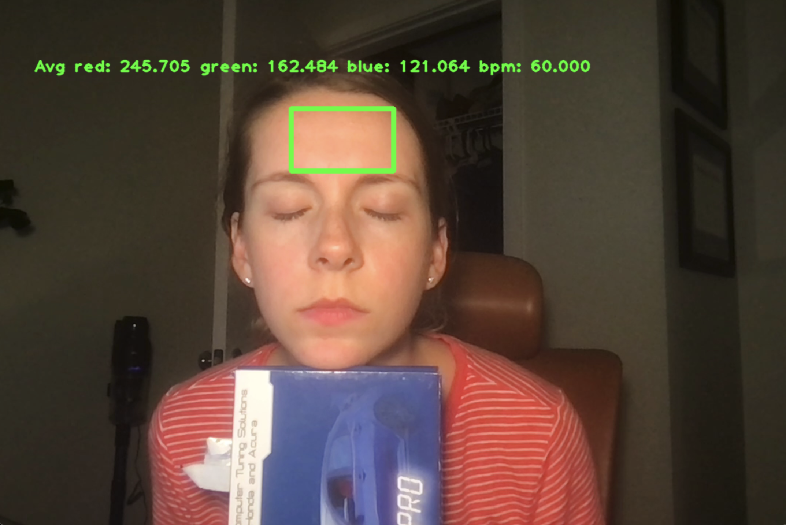
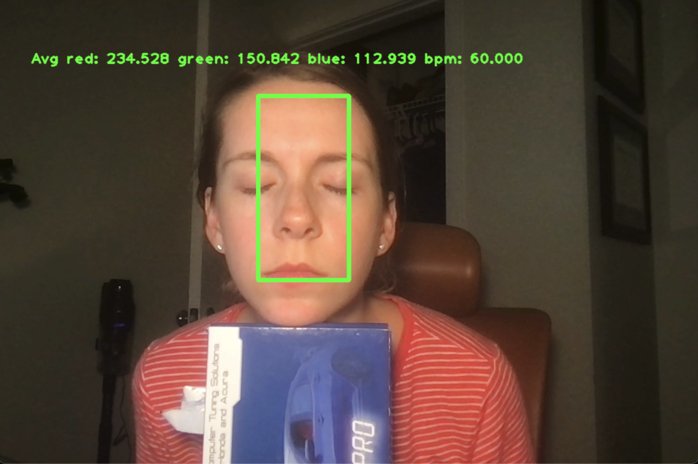
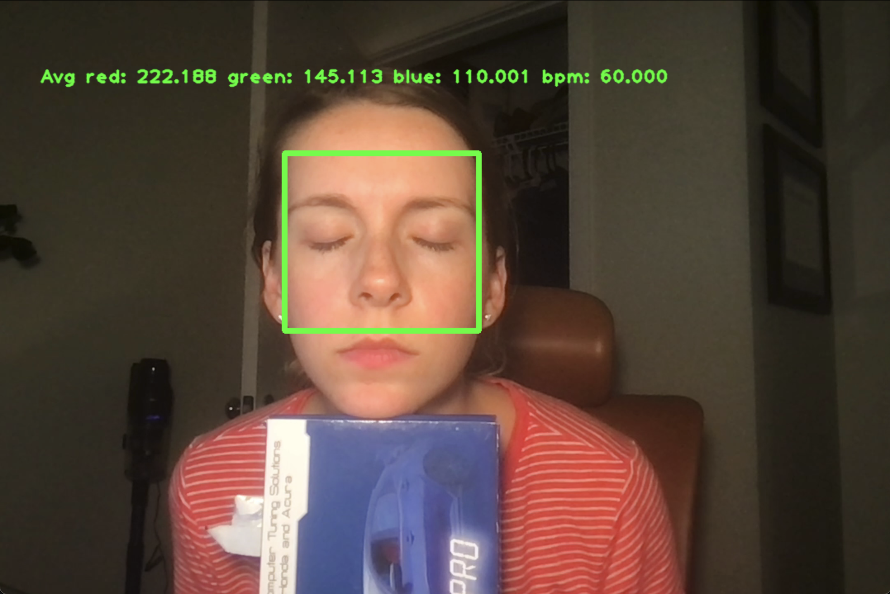

# Heart rate monitor

This project parses video to monitor heart rate in BPM. The video used for this exercise has resolution of `1080x720` and subject is stationary.

## Prerequisite

Build OpenCV [(linux reference)](https://docs.opencv.org/4.x/d7/d9f/tutorial_linux_install.html). There is a convenience script that will fetch and build and install the opencv in the local directory using the following commands:

```sh
cd third_party/opencv
./build-install-opencv.sh
```

Install Bazel using [bazelisk](https://docs.bazel.build/versions/5.4.1/install-bazelisk.html).

## Usages

The program produces heart rate from the video analysis. Please provide absolute path for files. Output of the program is a `stdout` reading of the BPM and, and a `processed_video.mp4` in the specified directory. In addition, it also outputs number of processsed frame and execution time in the `stdout`.

Arguments:
  1. `<video_file>` - Required. Path to the input video file.

  2. `[video_out_file]` - Optional. Path for saving the processed output video.

Examples run commands:
  1. `bazel run //main:monitor-threaded $PWD/codingtest.mov`

  2. `bazel run //main:monitor-threaded $PWD/codingtest.mov $PWD/processed_video.mp4`

  3. `bazel run //main:monitor $PWD/codingtest.mov $PWD/processed_video.mp4` (*slower*)


## Performance Measurements

### BPM vs Region of Interest (ROI) Size

BPM measurement stays the same for all three ROI size. Although, the bigger ROI tends to stablize the average of green-ness reading for the frame (Checkout the plots [here](python/README.md))

|| Small ROI | Medium ROI | Large ROI|
|---|---|---|---|
| BPM | 61.25 | 61.25 | 61.25 |
|Example| |  | |


### Time to execute

The naive implementation for parsing through the video takes ~3 seconds to provide hear rate measurement. If the video frames are written back to disk after annotation, the time required increases by ~4 times. With multi-threading, video writer can process in separate thread, and take about ~8 seconds.

| package | VideoWrite| MultiThreading| RUN1 | RUN2| RUN3| AVERAGE|
|---|---|---|---|---|---|---|
|`main:monitor`|No| No|3.196 | 2.792 | 2.685 | 2.891|
|`main:monitor`|Yes| No | 11.145 | 11.239 | 10.997 | 11.127|
|`main:monitor-threaded`|Yes| Yes | 8.360 | 8.079 | 8.52 | 8.31|


## Future Improvements

There are multiple improvements that can potentially make the measurement of heart rate robust:

1. Face Detection: Currently the Region of Interest (ROI) for heart rate detection is *hard coded*. To improve robustness, OpenCV's face detection can be used to find the ROI. This would increase the robustness of measurements where the subject is not completely stationary or the camera resolution changes.

2. Segmentation: Facial segmentation can improve the signal-to-noise ratio by reducing background clutter that could be present in the ROI. [reference](https://web.stanford.edu/class/cs231a/prev_projects_2016/finalReport.pdf)

3. Motion Analysis: Movement of blood induces a motion on the head that are visible even in this video where subject is resting their head on an object. This introduces some variability in the result if the ROI's edge is next to a contrasting area (i.e., some green object next to the subject). Additional motion analysis can help adjust the ROI and improve signal-to-noise ratio. Alternatively, motion can be used to augment heart-rate-analysis [reference](https://www.youtube.com/watch?v=EhZXDgG9oSk).

4. Brightness and Color Adjustment: While the video was mostly static, slight variability in brightness can be observed. While the change was gradual in this exercise video, it might be imperative we have a fixed exposure setting on the camera. If that is not possible, it might be necessary to manually adjust brightness in post processing to make the measurement more robust when the lighting condition can change.


## Other Limitations and potential work around

1. If you are building and running this program on *Apple silicon mac*, there might be some issue with missing aarm64 version of libraries. One known workaround albeit with some limitations is using docker with debian based image to build and install the program.

## Extras

See the *Python* implementation details and additional plots [here](python/README.md).


## Resources

1. Install bazelisk: [bazelisk reference](https://docs.bazel.build/versions/5.4.1/install-bazelisk.html)
2. Formatting library: [fmt](https://github.com/fmtlib/fmt)
3. You can convert the processed video for wider device support using FFMPEG: `ffmpeg -i processed_video.mp4 -c:v libx264 -preset slow -crf 22 -c:a aac -b:a 128k processed_video_x264.mp4`
<!-- 3. Plotting library: [matplot++](https://github.com/alandefreitas/matplotplusplus) -->
