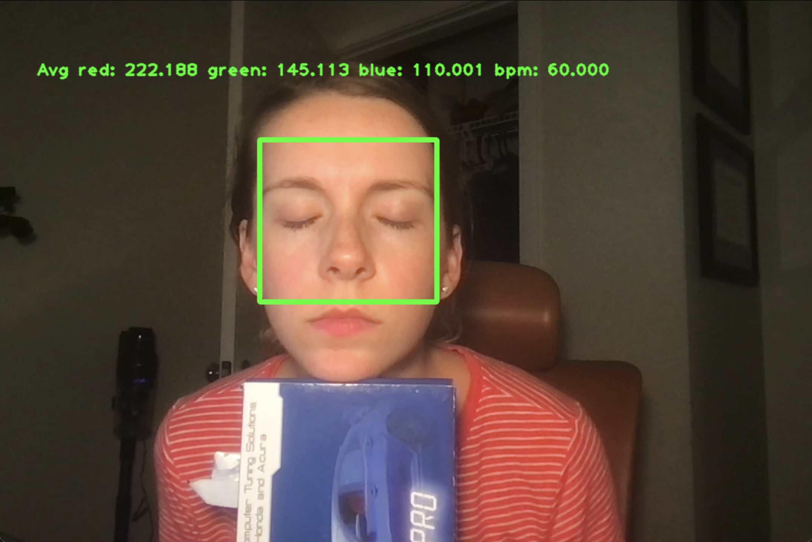

## Installation

1. Create a virtual environment: 
```sh
python3 -m venv .venv
```
2. Activate virtual environment:

```sh
source .venv/bin/activate
```

3. Install dependencies:
```sh
pip3 install -r requirements.txt
```

## Run Analysis

Run the following command to execute the python script that will run bpm analysis. Press q to exit the `CV window` at anytime.

```sh
python3 heart-rate-monitory.py
```

## Result: 


## ROI Small


## ROI Medium


## ROI Large


